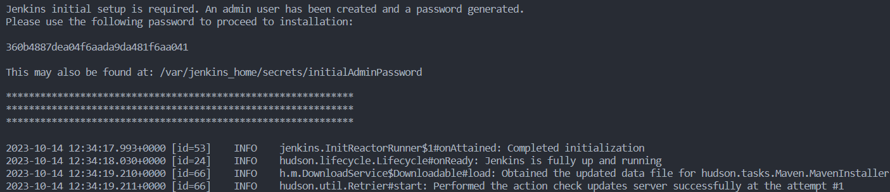
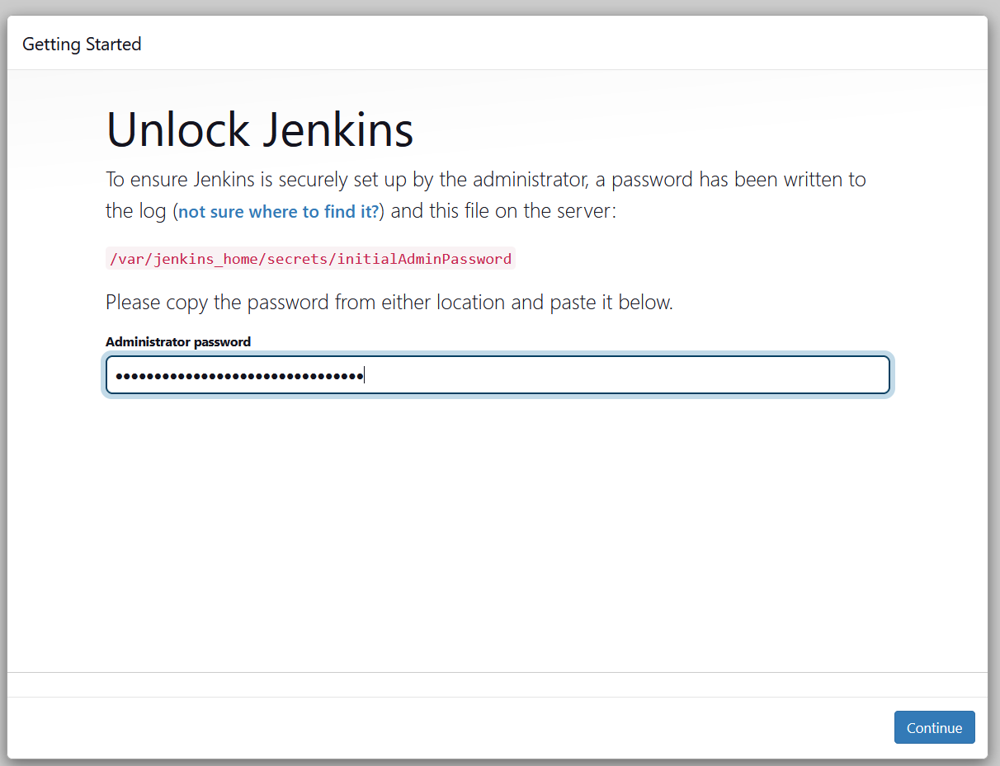
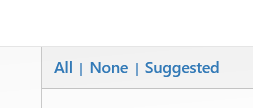
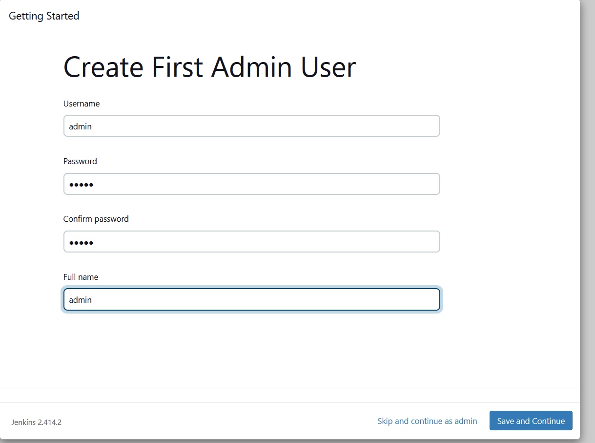

# Command to run docker
- "docker compose up"

# Command to see if container is running
- "docker ps"

# Command to stop and delete container docker
- "docker compose down"

# step to using jenkins

1. open in your browser http://localhost:8080/
2. open new terminal then type "docker logs jenkins"
3. copy this "360b4887dea04f6aada9da481f6aa041" like in image
3. 

4. then copy and paste like in this image below
5. 

6. click continue
7. click "install suggested plugins" if you want jenkins installed recomended plugin for you
   click "Select plugins to install" if you want manually select and install your jenkins plugin
8. click "none" then click install like this image below
    

9. input your username and passowrd
    

10. click everything in default
11. and finally you in jenkins dashboard
12. have fun to explore jenkins :)