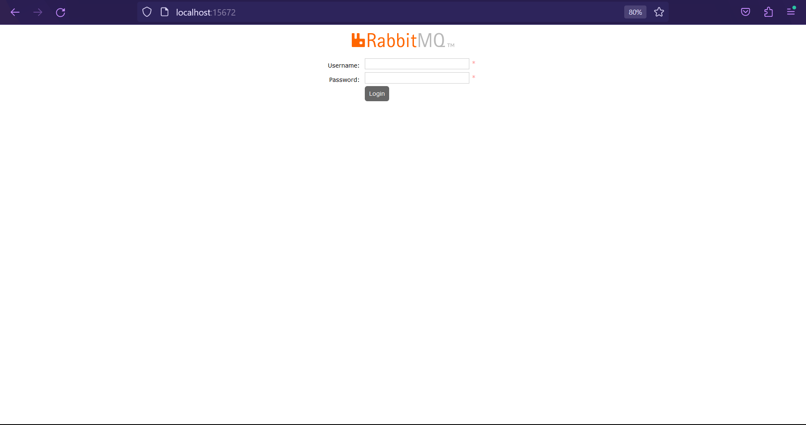
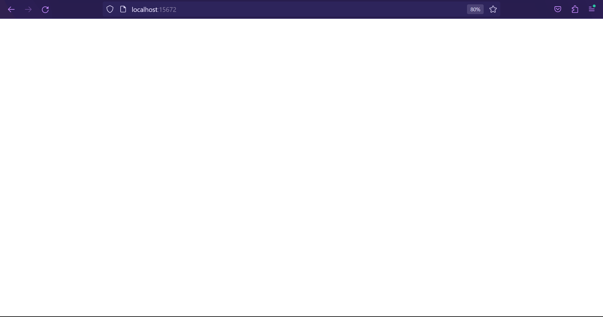

# Command to run docker
- "docker compose up"

# Command to stop and delete container docker
- "docker compose down"

# To check if rabbitmq is runnig
- hit this url http://localhost:15672/
- username: "guest"
- password: "guest"
- if result like this image below, rabbitmq running success

- if result like this image below, rabbitmq running failed
